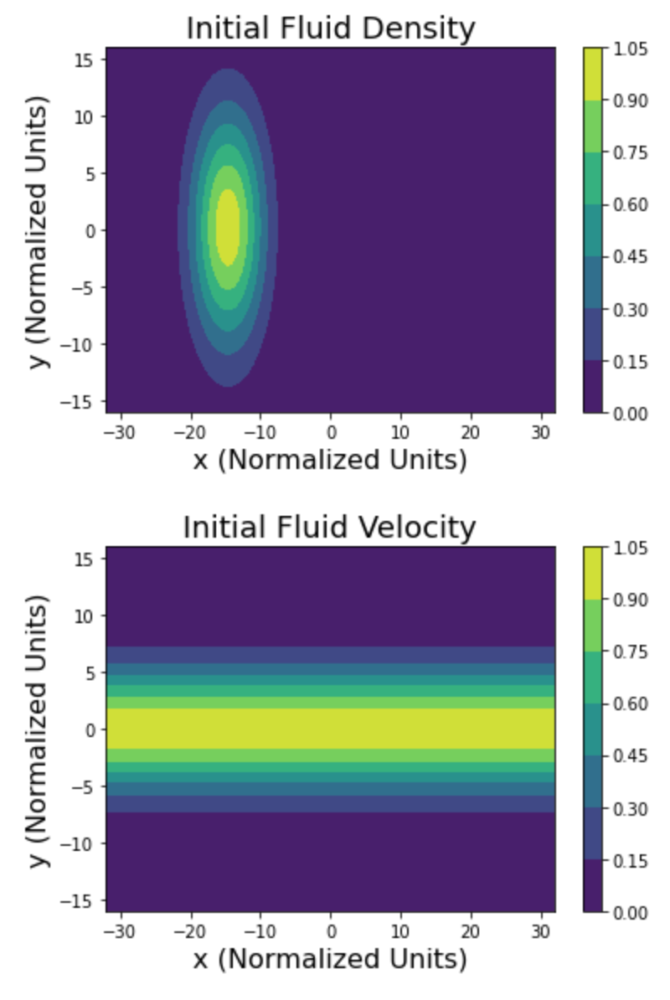
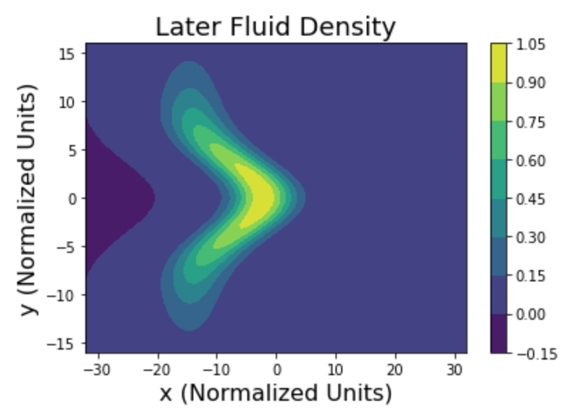
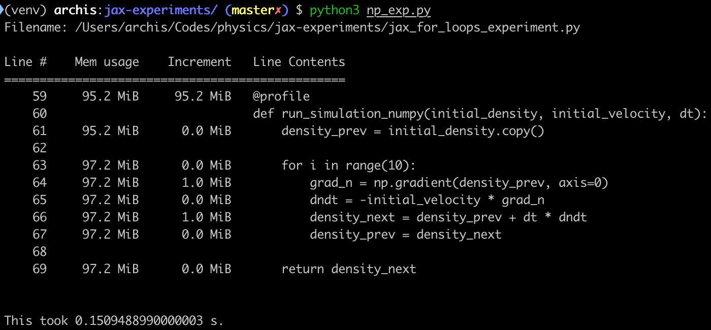
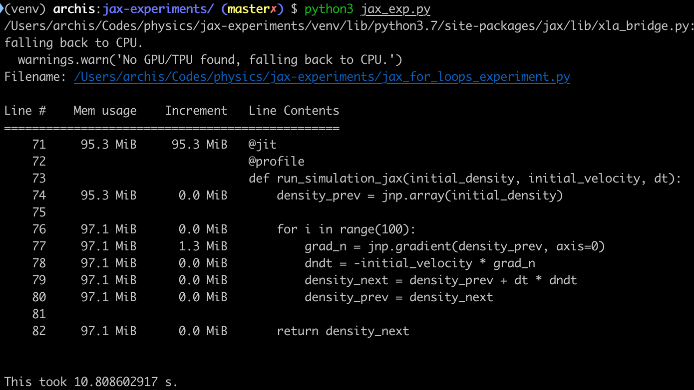
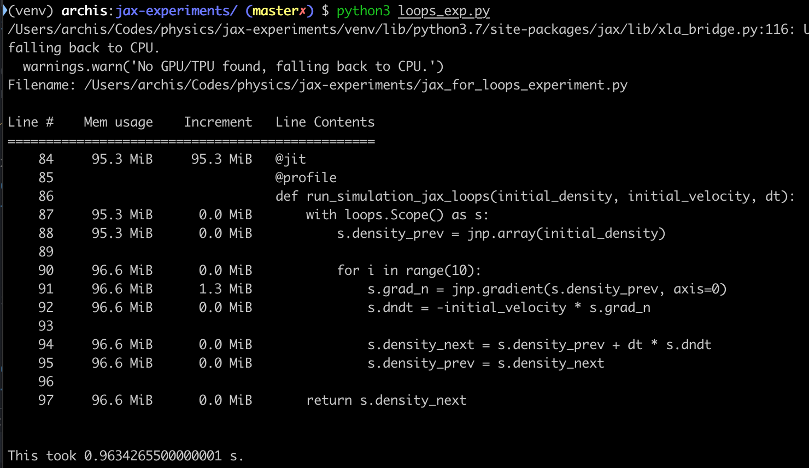

JAX [1] is this amazing creation that combines Autograd and XLA, and opens up a world of possibilities. 
That's a topic for another time.

There are some details of JAX that are a mystery to me. I wanted to improve my understanding of `jax.experimental.loops`
[2]. In general, the concept is simple. In JAX, it is best to write python while assuming that your code will be 
compiled Just In Time (JIT) before being shipped off to a CPU or GPU (or TPU). 

The JIT compilation unrolls all `for` loops. The `loops` scope lets you write code in the same way, but somehow helps 
with the JIT call. What I wanted to know was how?

Experimental Setup
------------------
I designed a for loop that contains relatively computationally-expensive operations every iteration. In particular,
the goal was to solve a simplified version of the 2D Navier-Stokes equation.

The simplifications are as follows:
1. The velocity field is only 1-dimensional, so that the 2D density only needs to be moved in 1 direction.
2. The velocity field does not evolve, i.e. the velocity field is at steady state. 

This is what we're doing in NumPy:
```python
    density_prev = initial_density.copy()

    for i in range(10):
        grad_n = np.gradient(density_prev, axis=0)
        dndt = -initial_velocity * grad_n
        density_next = density_prev + dt * dndt
        density_prev = density_next
```
where `initial_density` and `initial_velocity` are float arrays with shape `(512, 128)`. Making sure the 2D grid is 
relatively large ensured an adequately computationally intensive procedure.

You can find this code at [3].

This is what (an) initial condition look like:

It is important to emphasize that the velocity is only in the horizontal direction. At the end of the simulation, you 
expect to see something like the cover figure here where the middle of the domain has been moved forward in x.


The quantities that I'm measuring here are the `memory usage` and `clock time`. I used `memory-profiler` and 
`perf_counter` respectively. 


NumPy Results
---------------
I ran this simulation using NumPy and got the following result for timing and memory.


Timing: 0.15s
Memory: 1 MB

This seems reasonable. From what I understand, the `profiler` takes up 95 MB at launch, and then the `grad_n` call 
costs a bit more. The whole thing takes 0.15s  

JAX-Naive Results
------------------
I ran this simulation using a standard for loop and a `@jit` decorator around the simulation code and 
got the following result


Timing: 10.81s
Memory: 1.3 MB 

This seems a bit drastic! The memory hit is the same, but this time, the whole thing takes 10 s. That's 100x slower.

JAX-Loops Results
------------------
I ran this simulation using the `loops` scope instead of a regular `for` loop. I kept the `@jit` decorator on as well 
and got the following result

Timing: 0.96s
Memory: 1.3 MB

This is back to normal. Same memory hit as the previous attempts but not nearly as slow anymore. 

Conclusion
------------
Ah so that's the story! Using the `loops` scope enabled a speedup of 10x over the naive implementation (for this 
experiment). This is because the scope allows the user to circumvent the lengthy JIT process for a `for` loop.

As for the memory, I think the memory profiling didn't work here because XLA works under the hood, and I 
suspect the profiler can't see that part. There is also a possibility that the profiler is working properly, and that 
JAX doesn't need any more memory when unrolling the loop.

It'd be good to collect some data on how the compilation performance hit scales for larger arrays or larger loops and
then check the tradeoff with respect to the execution gains from an unrolled loop. [4] has a discussion on this topic.


Additional Reading:
1. [JAX Read-the-Docs](https://jax.readthedocs.io/en/latest/index.html)
2. [JAX Loops Read-the-Docs](https://jax.readthedocs.io/en/latest/jax.experimental.loops.html)
3. [JAX For Loop Experiments](https://github.com/joglekara/jax-experiments)
4. [Discussion on performance of unrolled loops](https://github.com/google/jax/issues/402)